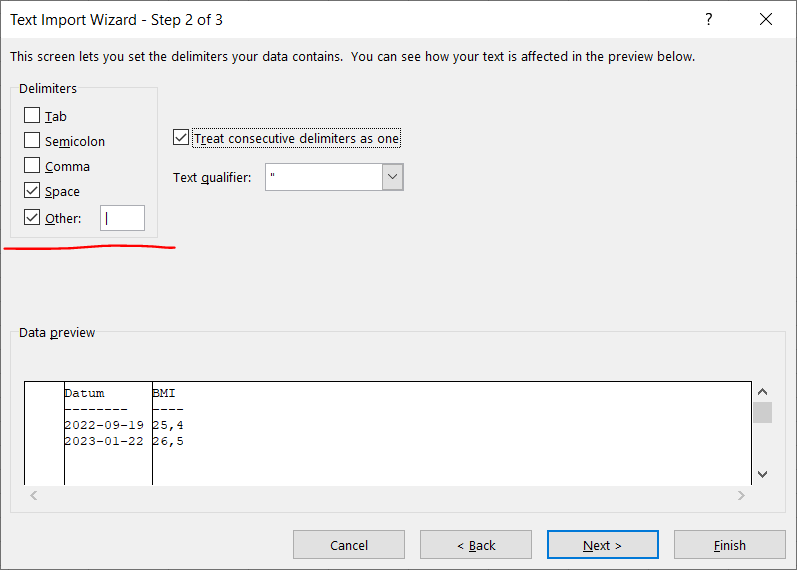

# GnuCOBOL-kurs
En liten GnuCOBOL-kurs med ett exempel på ett riktigt program.
 
För en nybörjarkurs rekommenderas denna https://github.com/COBOL-Erik/COBOL-Beginners-Course.

Ibland finns det Tips!-pilar att klicka på om man vill ha lite hjälp :-)
# Visual Studio Code, VSCode
När man utvecklar program behöver man en texteditor och en kompilator. En väldigt populär editor är VSCode, som även verkar vara den editor som kommer att gälla vid stordatorutveckling i framtiden. Vi rekommenderar i denna kurs att man använder sig av VSCode, men det fungerar med Anteckningar också.
 
VSCode är gratis, och kan laddas ned ifrån https://code.visualstudio.com/Download.

# Extensions
En stor fördel med VSCode är de många möjligheterna att anpassa utvecklingsmiljön med så kallade extensions. Man kan hitta dem och ladda ned dem genom att klicka på menyalternativet Extensions till vänster i VSCode.
 

 
Här kan man t ex söka på "COBOL" och se om man hittar något som kan hjälpa när man kodar. Det är såklart fördelaktigt om editorn ger hintar som guidar dig som utvecklare. Utforska gärna olika extensions! Man kan avinstallera eller inaktivera dem i efterhand.

# GnuCOBOL
Den kompilator vi ska använda heter [GnuCOBOL](https://gnucobol.sourceforge.io/). Den är en gratis, och man kan använda den på nästan vilken plattform som helst. Perfekt för den som redan kan COBOL att utnyttja sina skills i nya sammanhang. Också perfekt för den som är nyfiken på COBOL. Och eftersom COBOL är rakt och enkelt så är det perfekt för nybörjare.

Man kan ladda ned GnuCOBOL här: https://sourceforge.net/projects/gnucobol/files/
 
För enkelhets skull har jag med installionsfilen i detta repo. Man kan välja Code - Download ZIP uppe till höger för att ta ned GnuCOBOL. Extrahera zip-filen på valfri plats på datorn, dubbelklicka igång **GC31-VBI.exe**, följ instruktionerna och installera under **C:\WS\GnuCOBOL**.

# Terminalen
Det är mycket vanligt att man som utvecklare *skriver* kommandon till datorn, istället för eller i avsaknad av grafiska verktyg. T ex kan man behöva kompilera med kommandon, och så ska vi göra. På Windows är den primära terminalen Kommandotolken, som man kan dra igång genom att söka på **"cmd"**. Har man VSCode kan man med fördel använda den *inbyggda* terminalen. Ni hittar den säkert.

I terminalen ska man först "stå" i den mapp där man vill utveckla sitt program, säg C:\WS\GnuCOBOL-kurs. Skriv såhär i terminalen för att komma dit:

    > C:
    > cd C:\WS\GnuCOBOL-kurs

För att kunna hitta den *runtime* som krävs för GnuCOBOL måste man initialt köra skriptet **set_env.cmd**, som kommer med GnuCOBOL-installationen. Skriv såhär i terminalen:

    > C:\WS\GnuCOBOL\set_env.cmd

Nu är också GnuCOBOL-kompilatorn tillgänglig. Testa det genom att köra

    > cobc -version

# Koda lite
Öppna också C:\WS\GnuCOBOL-kurs i Utforskaren, eller ännu bättre i VSCode (välj File - Open Folder). 

Högerklicka och välj att skapa en ny fil. Döp den till **kurs.cob**. ".cob" är en *file extension* som indikerar att det rör sig om en GnuCOBOL-källkodsfil.

I COBOL brukar vanliga kodrader börja i kolumn åtta, alltså efter sju blanktecken. Gör förslagsvis så nu också. (Man kan skriva vad man vill i position 1-6; en asterisk, *, i position sju gör raden till en kommentarsrad som kompilatorn kommer att ignorera.)

Skriv in följande i kurs.cob:

    identification division.
    program-id. kurs.
    procedure division.
        display 'Hello, World!'
        goback
        .
    

(Ha gärna en avslutande helt tom sistarad i kurs.cob, annars ger kompilatorn en varning, som dock inte påverkar slutresultatet.)

Spara kurs.cob. Nu ska vi kompilera! Skriv i terminalen

    > cobc -x kurs.cob

"-x" betyder "ge mig en exekverbar fil", d v s ett program. I Windows blir det en .exe, i vårt fall kurs.exe.
 
Om koden nu *inte* börjar i position åtta, så får man lägga till kompileringsflaggan -free, såhär:

    > cobc -free -x kurs.cob

Gör man så kan man också ha kodrader som är upp till 255 tecken långa, istället för bara upp till och med kolumn 72.

Nu kan vi köra programmet! Skriv

    > .\kurs

Grattis! Vi har klarat av den obligatoriska programmeringsövningen "Hello, World!"!

# Prata
Men vi vill nu ha en personlig hälsning! Därför måste vi kunna skicka in vårt namn till kurs.exe. Man kan göra det på olika sätt, men vi ska utnyttja verbet <code>ACCEPT</code>. Namnet som användaren anger ska hamna i en *variabel* i programmet. Men då måste vi *deklarera* variabeln först. Det gör man i <code>WORKING-STORAGE SECTION</code> i <code>DATA DIVISION</code>. Skriv

    data division.
    working-storage section.
    01 namn             pic X(40).

efter "program-id"-raden i kurs.cob. Spara och kompilera igen. Klagar kompilatorn? Inte? Då fortsätter vi.

Det är i <code>PROCEDURE DIVISION</code> man skriver koden som faktiskt gör något. Härunder skriver vi nu

    display 'Ange ditt namn'
    accept namn

Fixa så att vi hälsar på användaren nu istället för "världen". Spara och kompilera. Exekvera. Bra?

# COBOL SCREEN SECTION
COBOL (dock ej Enterprise COBOL som vi har på stordatorn) har något som inget(?) annat språk har: möjlighet att rita textanvändargränssnitt (TUI) i terminalen. Vi kan därmed skapa en mer interaktiv applikation, som kanske kan upplevas som rätt lagom av både programmerare och användare.

Man definierar då fix och variabel text i SCREEN SECTION, också under DATA DIVISION. Här ska vi utnyttja möjligheten i COBOL att skapa grupper av variabler, som kan användas tillsammans. Koda såhär:

    screen section.
    01 FULL-SCREEN blank screen.
       05  pic X(11) value 'User name: '    line 02 col 5.
       05  pic X(30) using S-NAME           line 02 col 13.
       05  pic X(30) value 'Greeting:  '    line 04 col 5.
       05  pic X(60) using S-GREETING       line 05 col 5.

Detta ska vi sen skriva ut på skärmen, i terminalen. Men först måste vi deklarera S-NAME och S-GREETING, vars värden kan ändras av programmet eller av användaren. Deklarera dem i WORKING-STORAGE, gärna under en 01-nivå som heter SCREEN-IO, för att hålla koll på deras sammanhang. Vi väljer att kalla variablerna "S-" någonting för att man ska se direkt att de hör till vårt TUI. Andra "Arbetsvariabler" heter "A-" och brukar vara deklarerade på nivå 05 under <code>01 ARBETSVARIABLER.</code>

Tips!

Ej uttömmande men ledande deklarationer i Working storage:

    01 A-ARBETSAREOR.
       05 A-DUMMY pic X.
       05 A-LANGD pic S9V99   comp-3.
       05 A-VIKT  pic S999V99 comp-3.
       05 A-BMI   pic S999V99 comp-3.

    01 SCREEN-IO.
       05 S-NAME          pic X(30).
       05 S-GREETING      pic X(60).
       05 S-BMI           pic --9,99.
       

# (<>)

Den gamla namn-variablen kommer vi inte att använda mer. Ta bort den.

Nu är det hög tid att kompilera igen för att se om vi gjort något dumt. Det är bra att kolla det ofta så att det blir lätt att hitta felen.

I PROCEDURE DIVISION, ta bort allt utom GOBACK och avslutande punkt och lägg till

    move 'Foo Bar' to S-NAME
    move function concatenate('Hello '; S-NAME) to S-GREETING
    display FULL-SCREEN

FUNCTION CONCATENATE finns inte i någon annan COBOL än GnuCOBOL!

Spara, kompilera, exekvera. Ganska schysst va'?

# (<>)

När vi ändå är så coola att vi använder konkateneringsfunktionen så ska vi också lägga till <code>repository</code>:

    identification division.
    program-id. kurs.
    environment division.                   *> ny
    configuration section.                  *> ny
    repository. function all intrinsic.     *> ny
    special-names. decimal-point is comma.  *> Och denna rad ger "svensk" användning av kommatecken i tal
    data division.
    working-storage section.

Då slipper man skriva nyckelordet "FUNCTION" för varje *intrinsic function* man använder i PROCEDURE DIVISION. Bra! Då kan vi koda om såhär:

    move 'Foo Bar' to S-NAME
    move concatenate('Hello ' ; trim(S-NAME) ; '!')
      to S-GREETING
    display FULL-SCREEN

Bättre, eller hur? (Notera utropstecknet i hälsningen.)

# (<>)

Nå, det skulle ju vara interaktivt också. Vi ska ta in användarnamnet från ... användaren. Det gör vi fortfarande med ACCEPT, men nu tar vi in hela skärmen och alla variabler som används däri, med

    accept FULL-SCREEN

Så skippa hårdkodningen och låt användaren ange sitt namn istället. Visa sen upp en trevlig hälsning.

Tips!

En rolig sak man kan göra i GnuCOBOL är att hämta in påloggad användare, såhär:

    accept A-USER from environment "USERNAME"

Det kan vara användbart.

# (<>)

Programmet bör inte bara avsluta efter hälsningen, utan bör stoppas av användaren. Därför lägger vi till en ytterligare ACCEPT för att vänta på att användaren trycker \<enter\> en gång till. I sådana här lägen kan man ha en DUMMY-variabel som liksom används utan att användas. Det går också att koda <code>accept FULL-SCREEN</code> som tidigare. Lös det!

# Mellanspel
Är man inte bekant med COBOL-verben <code>EVALUATE</code> och <code>COMPUTE</code> så kan man läsa mer här: https://github.com/COBOL-Erik/COBOL-Beginners-Course

Det kan också vara bra att känna till de inbyggda funktionerna <code>test-numval()</code> och <code>numval()</code> som kontrollerar att ett *alfanumeriskt fält* innehåller ett tal, respektive gör om ett alfanumerisk värde till ett numeriskt värde. (Och kom ihåg att med repository-paragrafen så slipper man skriva "function" före funktionsnamnen.)

Tips!

    *> =0 el. första tecknet som inte är inledande blank, 0-9 eller ","
    if test-numval(S-LANGD) > 0 or test-numval(S-VIKT) > 0
       move 'Ange längd (m) och vikt (kg) som numeriska värden'
         to S-MEDDELANDE
    else
       move numval(S-LANGD) to A-LANGD
       move numval(S-VIKT)  to A-VIKT
       compute A-BMI rounded = ...
       move A-BMI to S-BMI
       evaluate true ...
          move ... to S-MEDDELANDE
    end-if

    display S-SCREEN

# Nu kan vi börja med ett riktigt program!
Uppgiften är att låta användaren i tre fält i vårt TUI mata in
1. Användarnamn
2. Längd
3. Vikt

Sen så ska användarens BMI, Body Mass Index, räknas fram och presenteras för användaren i ett nytt fält i vårt TUI. BMI beräknas med denna formel:

Börja med det, förslagsvis med COMPUTE ROUNDED. Klar? Då ska vi också skriva ut ett meddelande beroende på utfallet. Använd EVALUATE och skriv något med ledning av uppgifterna i denna tabell (var snäll! Detta är bara en programmeringsövning!)

# Statistik
Utöver hanteringen av vårt TUI ska vi nu också skriva resultatet på fil! Formatet ska vara såhär:

    |Datum| BMI |
    |--------|----|
    | 2022-09-19 | 25,4 |
    | 2023-01-22 | 26,5 |

Detta format beskriver i *markdown* en tabellform. Först kommer kolumnnamnen, en avskiljare med en massa bindestreck, och sen rader med värden. Observera att varje kolumn delas in med lodstreck, |, i programmeringssammanhang mer känt som *pipe character*. Det kan vara, men måste inte vara, blanktecken innan eller efter |. Det är inte nödvändigt att lodstrecken hamnar under varandra, men det ser ju bättre ut om de gör det. Vitsen med att skriva på detta format är att det finns verktyg som kan visa upp tabellen jättefint. T ex kan man öppna filen i VSCode (den bör heta något med .md, t ex stats.md). När den är öppen i Edit-läge, tryck **Ctrl-Shift-V**. Har man inte VSCode kan man t ex gå till https://markdowntohtml.com/.

Dagens datum kan tas in programmet med

    accept variabel from date YYYYMMDD

Tips!

Under CONFIGURATION SECTION, skriv in

    input-output section.
    file-control.
        select STATS
        assign to '.\stats.md' *> eller ett variabelnamn
        organization is line sequential.

"organization is line sequential" är special för PC-COBOL så att varje rad blir en "post".

Under DATA DIVISION, skriv in 

    file section.
    FD STATS.
       01 stat-line        pic X(70).

I PROCEDURE DIVISION skriver man OPEN, WRITE och CLOSE:

    open extend STATS
    ...
    write stat-line
    ...
    close STATS

# Importera till Excel
Om man vet hur man gör så är det enkelt att importera filen vi skrivit in i Excel. Då kan man också enkelt rita upp en graf som visar utvecklingen(?!) över tid.

Tips!

1. Starta Excel

2. I en ny workbook, välj Import av textfil

</img>

3. Leta upp stats.md (eller vad ni nu kallat den)

</img>

4.

</img>

5.

</img>

6. Skippa första kolumnen; gör andra till datum

</img>

7. Klicka på OK
8. Ta bort rad 2 (högerklicka och välj Delete)
9. Markera datat och klicka fram Quick Analysis. Välj en chart.

</img>

# Klart! Bra jobbat!
Hoppas ni har fått en liten inblick i hur det kan vara att jobba med utveckling i COBOL på PC!

# Extrauppgift
Har ni inte fått nog kommer här en extrauppgift: Alla i hushållet kanske vill använda denna applikation! Spara därför också vilken användare som loggat sitt BMI. Varje användare kan få en egen fil. Och då kan vi lika bra spara i den filen eller i ytterligare en annan fil när användaren senast körde kurs.exe, och också användarens längd som antas vara den samma vid flera konsekutiva användningstillfällen. Läs in och skriv ut dessa uppgifter i vårt TUI, efter att användaren angivit sitt användarnamn. Det blir lite som en cookie som webbläsare sparar.